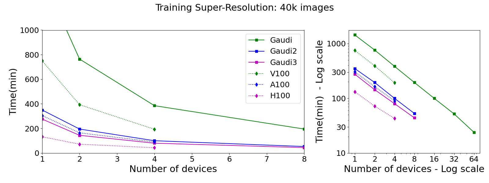

# Scaling of a Diffusion model on different accelerators
In this section we provide the tools to reproduce the results shown on the PEARC26 paper.

The code used for this test is the [Super-Resolution-SR3](https://github.com/javierhndev/Super-Resolution-SR3) which a Super Resolution model (based on Diffusion) that has been ported to Intel Gaudi architecture and parallelized to use Pytorch DDP. This code was forked from [Image-Super-Resolution-via-Iterative-Refinement](https://github.com/Janspiry/Image-Super-Resolution-via-Iterative-Refinement) which follows the orginal method from the paper with the same name: [Image Super-Resolution via Iterative Refinement](https://arxiv.org/abs/2104.07636)

## Results
The results from the analysis are contained in the following figure:

The figure can be reproduced executing the `plot_scaling.py` script. The file contains the data.

## Reproducibility
The task tested here was to run the model in training mode over 40,000 images. We took images generated by [PySM](https://github.com/galsci/pysm) but any set of 256x256 images should suffice since we only tested code performance but no results.

The model was executed on SDSC [Expanse](https://www.sdsc.edu/systems/expanse/index.html) and [Voyager](https://www.sdsc.edu/systems/voyager/index.html) HPC systems. Expanse uses slurm to manage jobs while Voyager is a Kubernetes based machine. On `expanse` and `voyager` folders we are keeping a copy of the configuration files and scripts necessary to execute the model on both systems.

The model was executed on Expanse using Singularity and the SDSC provided containers. The model run on NVIDIA V100, A100 and H100. Note that the [Super-Resolution-SR3](https://github.com/javierhndev/Super-Resolution-SR3) needs to be run on GPU mode which can be done setting the branch to `nvidia`.

On Voyager, the model was executed using Kubernetes and SynapseAI 1.21.4 on both Gaudi1 and Gaudi2. Note that Lazy mode was set because the Diffusion models have not been yet optimized for Eager mode.

## Requirements

To reproduce the figure with the results only `matplotlib` package is necessary.

The requirements to execute the Diffusion model are located in its own repository (and in the `expanse` folder).